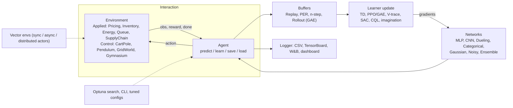

<div align="center">


# decisionrl

Reinforcement learning for operational decisions.

[](https://github.com/DenisDrobyshev/decisionrl/actions/workflows/ci.yml)
[](https://pypi.org/project/decisionrl/)
[](https://denisdrobyshev.github.io/decisionrl/)
[](https://www.python.org)
[](LICENSE)
[](https://github.com/astral-sh/ruff)
[](https://mypy-lang.org/)

[](docs/algorithms.md)
[-2ea043.svg)](docs/environments.md)
[](docs/evolution.md)
[](tests)
[](tests)
[](https://pytorch.org)

</div>

## Overview

Most reinforcement learning libraries target games and robotics (Atari, MuJoCo,
control suites). `decisionrl` targets operational decisions: pricing, inventory,
energy, queueing, and supply chains. Each of these problems ships as a first-class
environment paired with the classical operations-research baseline, so a learned
policy can be measured against the standard method rather than asserted to be good.

Underneath the applied layer is a dependency-light (NumPy and PyTorch) library of 31
algorithms with a single `predict` / `learn` / `save` / `load` interface, static
typing, and a test suite that checks both component correctness and learning behaviour.

```bash
pip install decisionrl
```

## Results

The tables below compare a trained policy against the strongest classical baseline for
each task. Numbers are the mean and standard deviation of the evaluation return over 3
seeds, reproduced on CPU by [`examples/verify_applied_claims.py`](examples/verify_applied_claims.py).

Tasks where the classical assumptions break and the learned policy is better:

| Applied task | Learned policy | Classical baseline |
|---|---:|---:|
| Non-stationary inventory (drifting demand) | **278.5 ± 2.4** profit | 240.7 (best fixed base-stock) |
| Energy microgrid (battery) | **20.3 ± 0.3** return | 16.7 (greedy price-threshold) |
| Supply chain (2-echelon) | **-31.1 ± 0.3** cost | -35.3 (per-echelon base-stock) |
| Queue admission control | **24.7 ± 0.2** value | 23.0 (best value threshold) |
| Thermostat / HVAC | **-40 ± 18** return | -305 (bang-bang) |

Tasks where the classical method is already optimal and the learned policy matches it:

| Applied task | Learned policy | Optimal baseline |
|---|---:|---:|
| Inventory (stationary demand) | 193.3 ± 5.3 profit | 196.1 (exact DP optimum, value iteration) |
| Dynamic pricing | 25.3 ± 0.0 revenue | 25.5 (best fixed price) |

For a stationary inventory MDP the optimum is computable exactly by value iteration
(`decisionrl.solvers`), and the learned policy lands within a few percent of it. When
the problem stops being a small stationary MDP (drifting demand, partial observability,
coupled decisions) the solver no longer applies, which is the case the first table
covers. The comparison is always against the best fixed rule, not a naive default.

## Why RL and not a solver

If a decision problem is stationary and fully observed, a classical tool is usually the
better choice: a base-stock formula, an LP or MIP solver (Gurobi, OR-Tools), or queueing
theory is interpretable and provably optimal. On stationary inventory the learned policy
only matches the base-stock optimum; it does not beat it.

Learning is worth reaching for when those assumptions fail: non-stationary or drifting
demand, partial observability, coupled decisions with no closed form, or dynamics that
cannot be written as a clean program. In [`NonstationaryInventory`](docs/environments.md)
the demand rate switches between regimes, so no single base-stock level is correct. A
policy that reads recent demand and tracks the regime beats the best fixed base-stock by
about 16 percent (278.5 ± 2.4 vs 240.7 over 3 seeds), with no per-regime formula derived
by hand.

## Installation

```bash
# from PyPI
pip install decisionrl

# with the optional Gymnasium environments
pip install "decisionrl[gym]"

# latest from source
pip install git+https://github.com/DenisDrobyshev/decisionrl.git

# local development install
git clone https://github.com/DenisDrobyshev/decisionrl.git
cd decisionrl
pip install -e ".[dev]"
```

The PyPI distribution, the import package, and the repository all use the name
`decisionrl`.

## Quick start

Train an operational policy and compare it to the textbook heuristic:

```python
from decisionrl import make_env, make_agent
from decisionrl.training import evaluate_policy

env = make_env("InventoryManagement")           # reorder under stochastic demand
agent = make_agent("ppo", env, seed=0).learn(40_000)
print(evaluate_policy(agent, make_env("InventoryManagement"), n_episodes=20))
# profit on par with the optimal base-stock policy, learned from scratch
```

The same interface covers classic control:

```python
from decisionrl.algorithms import PPO
from decisionrl.envs import CartPole
from decisionrl.training import evaluate_policy
from decisionrl.utils import set_seed

set_seed(0)
agent = PPO(CartPole(), n_steps=1024, seed=0)
agent.learn(total_steps=50_000)

mean, std = evaluate_policy(agent, CartPole(), n_episodes=20)
print(f"return = {mean:.1f} +/- {std:.1f}")

agent.save("ppo_cartpole.pt")
agent = PPO.load("ppo_cartpole.pt", env=CartPole())
```

Tabular, continuous, Gymnasium, and vectorized training use the same pattern:

```python
from decisionrl.algorithms import QLearning, SAC, PPO
from decisionrl.envs import GridWorld, Pendulum, make_gym
from decisionrl.wrappers import SyncVectorEnv

QLearning(GridWorld(rows=5, cols=5), seed=0).learn(20_000)
SAC(Pendulum(), seed=0).learn(20_000)
PPO(make_gym("CartPole-v1"), seed=0).learn(100_000)          # optional Gymnasium extra

venv = SyncVectorEnv([lambda: CartPole() for _ in range(8)])  # 8 x 256 = 2048 steps/update
PPO(venv, n_steps=256, seed=0).learn(200_000)
```

## Applied environments

`decisionrl` ships eight environments that model operational decisions, each with the
classical operations-research baseline. Train all of them and print the comparison table
with [`python examples/applied_rl_demo.py`](examples/applied_rl_demo.py). A short
walkthrough is in the notebook
[Applied RL in 15 minutes](examples/applied_rl.ipynb)
([Colab](https://colab.research.google.com/github/DenisDrobyshev/decisionrl/blob/main/examples/applied_rl.ipynb)),
and there is a self-contained
[browser demo](https://denisdrobyshev.github.io/decisionrl/demo/inventory.html) that runs
a trained policy against the base-stock rule with no server.

| Applied task | Decision | Baseline | Result |
|---|---|---|---|
| Non-stationary inventory | reorder as demand drifts | best fixed base-stock | RL better |
| Supply chain (2-echelon) | orders across the chain | per-echelon base-stock | RL better |
| Queue admission control | admit or shed each job | best value threshold | RL better |
| Energy microgrid | charge or discharge a battery | greedy price-threshold | RL better |
| Thermostat / HVAC | heating and cooling power | bang-bang | RL better |
| Inventory (stationary) | how much to reorder | base-stock (DP optimum) | RL matches |
| Dynamic pricing | what price to set | best fixed price | RL matches |
| Joint pricing + inventory | price and order together | best static (price, base-stock) | RL slightly better |

The classical baselines live in `decisionrl.baselines` and the exact dynamic-programming
optima in `decisionrl.solvers`, so every comparison is reproducible. Two figures below
come from [`python examples/applied_demo.py`](examples/applied_demo.py).

### Inventory management

An agent sets weekly reorder quantities under Poisson demand, trading off holding cost,
ordering cost, and stockouts. PPO recovers the optimal base-stock policy from scratch: it
matches the analytic heuristic (about 195 vs 197 profit) and clears a random policy
(about 160), with no domain knowledge.


### Thermostat / HVAC control

An agent modulates a heating and cooling unit to hold a room at its setpoint while the
outdoor temperature follows a daily cycle. SAC tracks the setpoint using roughly one
third of the energy of a bang-bang thermostat (return about -36 vs -304; energy about 59
vs 200).


## Architecture



### Design principles

1. Correctness first. The Gymnasium `terminated` versus `truncated` distinction is
   bootstrapped correctly everywhere: time-limit truncation bootstraps from the final
   observation, true termination does not. The library also implements GAE,
   target-policy smoothing, automatic entropy tuning, orthogonal initialization, and
   advantage and observation/reward normalization.
2. Dependency-light and batteries-included. The core needs only NumPy and PyTorch.
   Built-in environments (GridWorld, bandit, CartPole, Pendulum, PointMass) allow
   end-to-end training with no extra installs. Gymnasium is an optional extra.
3. One interface. Tabular or deep, discrete or continuous, on-policy or off-policy,
   every agent exposes `predict`, `learn`, `save`, and `load`.

## Command-line interface

Tuned default hyperparameters are applied per (algorithm, environment) and can be
overridden:

```bash
decisionrl list                                          # available algorithms and envs
decisionrl train ppo CartPole --steps 50000 --save ppo.pt --progress
decisionrl train dqn CartPole --set learning_rate=5e-4 --set buffer_size=100000
decisionrl train ppo CartPole --n-envs 8 --async         # parallel data collection
decisionrl eval ppo --env CartPole --load ppo.pt --episodes 20
decisionrl play ppo --env CartPole --load ppo.pt         # watch a trained agent
decisionrl run examples/configs/ppo_cartpole.yaml        # run from a config file
decisionrl dashboard run.csv                             # live web dashboard
```

Experiments can also be declared in YAML or JSON and run with `decisionrl run` or
`decisionrl.config.run`; `decisionrl.tracking` records a manifest (git commit, library
versions, seed, config, metrics) for reproducibility.

## Benchmarks

Head-to-head runs against Stable-Baselines3 2.9.0, library defaults, 3 seeds, CPU
(see [docs/benchmarks.md](docs/benchmarks.md)):

| Algorithm | Environment | Steps | decisionrl | SB3 2.9.0 |
|---|---|---:|---:|---:|
| PPO | CartPole-v1 | 50,000 | 500.0 ± 0.0 | 500.0 ± 0.0 |
| DQN | CartPole-v1 | 50,000 | 327 ± 122 | 96 ± 57 |

PPO reaches parity. On DQN at this budget `decisionrl` scores higher but with higher
variance and slower wall-clock per seed; SB3's data pipeline is more optimized. The
built-in control tasks and reproduced scores for every algorithm are in
[docs/benchmarks.md](docs/benchmarks.md).

## Algorithms

| Family | Algorithm | Class | Action space | Notes |
|---|---|---|---|---|
| Tabular | Q-Learning | `QLearning` | Discrete | off-policy TD |
| Tabular | SARSA | `SARSA` | Discrete | on-policy TD |
| Tabular | Expected SARSA | `ExpectedSARSA` | Discrete | lower-variance TD |
| Model-based | Dyna-Q | `DynaQ` | Discrete | learned model and planning |
| Model-based | MBPO | `MBPO` | Continuous | ensemble dynamics, short rollouts, SAC |
| Model-based | Dreamer (experimental) | `Dreamer` | Continuous | latent world model and imagination |
| Model-based | DreamerRSSM (experimental) | `DreamerRSSM` | Continuous | RSSM world model (GRU, stochastic latent, KL) |
| Value-based | DQN | `DQN` | Discrete | Double, Dueling, PER, n-step, CNN |
| Value-based | C51 | `C51` | Discrete | distributional (categorical) |
| Value-based | QR-DQN | `QRDQN` | Discrete | distributional (quantile regression) |
| Value-based | Rainbow | `Rainbow` | Discrete | Double, Dueling, PER, n-step, C51, NoisyNets |
| Goal-conditioned | HER + DQN | `HERDQN` | Discrete (goal env) | hindsight goal relabeling |
| Policy gradient | REINFORCE | `REINFORCE` | Discrete, Continuous | learned baseline |
| Actor-critic | A2C | `A2C` | Discrete, Continuous | GAE, vectorized |
| Actor-critic | PPO | `PPO` | Discrete, Continuous | clipped objective, GAE, KL early-stop |
| Actor-critic | TRPO | `TRPO` | Discrete, Continuous | KL trust region, conjugate-gradient step, line search |
| Actor-critic | GRPO | `GRPO` | Discrete, Continuous | critic-free, group-relative advantage |
| Actor-critic | IMPALA | `IMPALA` | Discrete, Continuous | V-trace, parallel actors |
| Actor-critic | Recurrent PPO | `RecurrentPPO` | Discrete | LSTM policy for partial observability |
| Actor-critic | SAC (discrete) | `SACDiscrete` | Discrete | max-entropy, automatic temperature |
| Continuous | DDPG | `DDPG` | Continuous | deterministic policy, noise, PER, n-step |
| Continuous | TD3 | `TD3` | Continuous | twin critics, delayed updates, PER, n-step |
| Continuous | SAC | `SAC` | Continuous | max-entropy, automatic temperature, PER, n-step |
| Offline | TD3+BC | `TD3BC` | Continuous | learns from a fixed dataset |
| Offline | IQL | `IQL` | Continuous | expectile value, advantage-weighted policy |
| Offline | CQL | `CQL` | Continuous | conservative Q-learning (SAC backbone) |
| Offline | Decision Transformer | `DecisionTransformer` | Discrete, Continuous | return-conditioned sequence model |
| Imitation | Diffusion Policy | `DiffusionPolicy` | Continuous | conditional denoising-diffusion policy |

Reproduced scores for these algorithms are in [docs/benchmarks.md](docs/benchmarks.md).

## Beyond operations

The applied layer sits on a general reinforcement learning library. The following are
part of the package and are covered by the test suite; they are useful when an
operational problem needs them and serve as evidence that the core is implemented
correctly.

- Preference-based RLHF and DPO on control tasks (`decisionrl.rlhf`).
- RLHF on a character-level GPT (`decisionrl.text`): supervised pre-training, then
  reward fine-tuning with a KL penalty to the reference model.
- Imitation learning: BC, DAgger, and GAIL (`decisionrl.imitation`).
- Curiosity (RND, ICM) and offline return-conditioned control
  (`decisionrl.exploration`, `DecisionTransformer`).
- Gradient-free optimization: 12 evolution and swarm methods with an ask/tell interface,
  plus a `NeuroevolutionAgent` (`decisionrl.evolution`).
- AlphaZero (MCTS and self-play) for two-player perfect-information games
  (`decisionrl.alphazero`).
- Meta-RL (RL^2) for online adaptation across a task distribution (`decisionrl.meta`).
- Multi-agent self-play and IPPO (`decisionrl.multiagent`).
- Distributed IMPALA-style actors feeding a central V-trace learner
  (`decisionrl.distributed`).
- ONNX and TorchScript export with a torch-free FastAPI serving image
  (`decisionrl.serving`), plus a model zoo and browser export.

Usage for each is documented at
[denisdrobyshev.github.io/decisionrl](https://denisdrobyshev.github.io/decisionrl/).

## Reproducibility and testing

```python
from decisionrl.utils import set_seed
set_seed(42, deterministic=True)   # seeds Python, NumPy, and PyTorch
```

Every agent accepts a `seed` argument, every environment accepts `reset(seed=...)`, and
every buffer and space has its own seedable RNG.

```bash
pip install -e ".[dev]"
pytest -m "not slow"    # unit and fast integration tests
pytest -m "slow"        # learning/integration tests (trains agents)
ruff check . && mypy
```

The suite covers component correctness (spaces, buffers, sum-tree, schedules, GAE,
normalization, save/load round-trips) and learning behaviour (tabular methods reach the
optimal GridWorld policy; DQN and PPO learn CartPole; SAC, TD3, and DDPG solve the
PointMass task). A scheduled workflow re-runs the multi-seed applied verification nightly
and fails if any reported result regresses below its baseline.

## Design notes

- Terminated versus truncated. Off-policy buffers store the `terminated` flag only, so
  bootstrapping targets are correct on time-limit truncation. On-policy rollouts add
  `gamma * V(final_obs)` at truncated steps and mark the episode boundary.
- No hidden global state. There are no implicit registries or configuration magic; you
  construct objects and call methods.
- Small surface, checked correctness. The package targets a codebase that is readable and
  verifiable rather than exhaustive.

## License

[MIT](LICENSE), Denis Drobyshev, 2026.

## Acknowledgements

The design draws on CleanRL (single-file clarity), Stable-Baselines3 (API design),
Tianshou (modularity), and the Farama Foundation's Gymnasium interface.
