<div align="center">

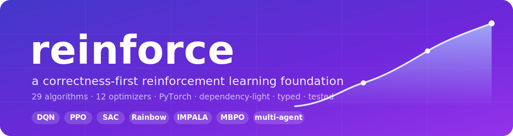

# decisionrl

**Reinforcement learning for operational decisions.**

Most RL libraries are built for games and robots — Atari, MuJoCo, control suites.
`decisionrl` is built for the decisions businesses actually make: **pricing,
inventory, energy, queueing and supply chains.** It ships the environments, the
baselines to beat, and the proof — on top of a dependency-light, correctness-first
library of 31 algorithms.

[](https://github.com/DenisDrobyshev/decisionrl/actions/workflows/ci.yml)
[](https://pypi.org/project/decisionrl/)
[](https://denisdrobyshev.github.io/decisionrl/)
[](https://www.python.org)
[](LICENSE)
[](https://github.com/astral-sh/ruff)
[](https://mypy-lang.org/)
[](https://colab.research.google.com/github/DenisDrobyshev/decisionrl/blob/main/examples/quickstart.ipynb)

[](docs/algorithms.md)
[-2ea043.svg)](docs/environments.md)
[](docs/evolution.md)
[](tests)
[](tests)
[](https://pytorch.org)
[](https://denisdrobyshev.github.io/decisionrl/)

<em>Operational-decision environments, each with the baseline it beats — on a typed, tested RL library.</em>

</div>

---

## Why decisionrl

Pick up SB3 or CleanRL and you get Atari and MuJoCo. Real operational problems —
"what price today?", "how much to reorder?", "charge or discharge the battery?",
"admit this job or shed it?" — you build yourself. `decisionrl` ships them as
first-class environments, each with the classic baseline, so you can *prove* the
learned policy rather than assert it.

**Where classical methods break — RL wins.** Compared against the *strong* classical
baseline (not a straw man), 3 seeds, mean ± std:

| Applied task | Learned (RL) | Strong baseline |
|---|---:|---:|
| 📈 Non-stationary inventory (drifting demand) | **278.5 ± 2.4** profit | 240.7 · best fixed base-stock |
| 🔋 Energy microgrid (battery) | **20.3 ± 0.3** return | 16.7 · greedy price-threshold |
| 🚚 Supply chain (2-echelon) | **−31.1 ± 0.3** cost | −35.3 · per-echelon base-stock |
| 🎛️ Queue admission control | **24.7 ± 0.2** value | 23.0 · best value threshold |
| 🌡️ Thermostat / HVAC | **−40 ± 18** return | −305 · bang-bang (⅓ the energy) |

**Where the classic tool is already optimal — RL matches it** (honest sanity checks):

| Applied task | Learned (RL) | Optimal baseline |
|---|---:|---:|
| 📦 Inventory (stationary demand) | 193.3 ± 5.3 profit | 196.1 · **exact DP optimum** *(value iteration)* |
| 🏷️ Dynamic pricing | 25.3 ± 0.0 revenue | 25.5 · best fixed price |

For the stationary inventory MDP the true optimum is computable exactly by value
iteration (`decisionrl.solvers`) — RL lands within a few percent of it *from scratch*.
That is the honest boundary of the classical approach: the moment the problem stops
being a small stationary MDP (drifting demand, partial observability, coupled
decisions), the solver no longer applies and the top table takes over.

The point isn't "RL beats operations research" — often it can't, and the README says
so (bottom table). The point is the **top table**: when demand drifts or decisions
couple, the closed-form breaks and a learned policy pulls ahead — even against the
*best* fixed rule, not a naive default.

Every number above is reproduced over multiple seeds by
[`examples/verify_applied_claims.py`](examples/verify_applied_claims.py) (or the
single-seed [`examples/applied_rl_demo.py`](examples/applied_rl_demo.py)) on CPU.
(There's a full, typed RL library underneath — see
[Beyond operations](#beyond-operations) — but the operational core is the point.)

## Why RL, and not a solver?

Fair question — and the honest answer is *often you shouldn't*. If a problem is
**stationary and fully observed**, reach for the classic tool: a base-stock formula,
an LP/MIP solver (Gurobi, OR-Tools) or queueing theory is interpretable and provably
optimal. `decisionrl` doesn't hide this — on stationary inventory the learned policy
only **matches** the base-stock optimum, it doesn't beat it.

RL earns its place where those assumptions break: **non-stationary / drifting demand,
partial observability, coupled decisions with no closed form, or dynamics you can't
write as a clean program.** The sharpest example here is
[`NonstationaryInventory`](docs/environments.md) — the demand rate switches between
regimes, so *no single base-stock level is right*, and an adaptive policy that reads
recent demand and tracks the regime beats the best fixed base-stock by **~16%** (278.5
± 2.4 vs 240.7 over 3 seeds), with no per-regime formula derived by hand. That gap is
the reason to reach for learning; when it isn't there, use the solver.

## Overview

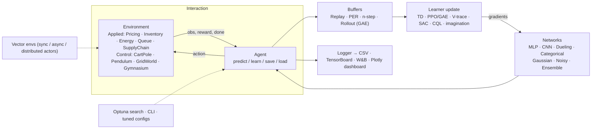


## Core RL sanity checks

The applied results above are the point; these are the classic-control sanity
checks every RL library is expected to pass — reassurance that the algorithms are
correct. Each figure is produced by a **single command** —
[`python examples/benchmark.py`](examples/benchmark.py) — which trains four agents
on four control tasks *from scratch on CPU* in a few minutes and renders the plots.

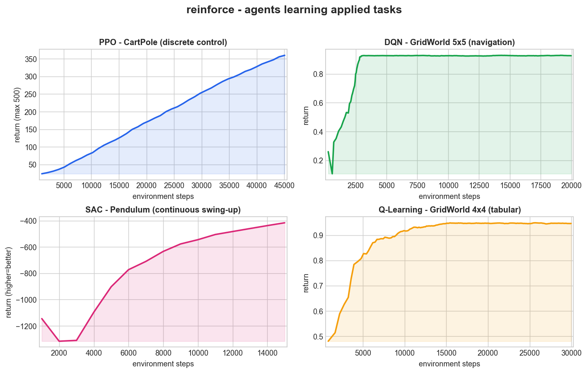

| Task | Algorithm | Result |
|---|---|---|
| CartPole (balance) | PPO | solved — return **500 / 500** |
| GridWorld 5×5 (navigate) | DQN (Double + Dueling) | near-optimal — return **≈ 0.93** |
| Pendulum (swing-up) | SAC | improves from ≈ −1300 to ≈ −420 |
| GridWorld 4×4 (navigate) | Q-Learning | optimal — return **≈ 0.95** |

The tabular agent recovers the optimal navigation policy (every arrow flows to the goal):

<p align="center">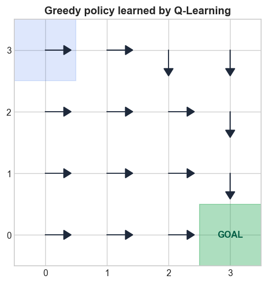</p>

## Watch trained agents

<p align="center">
  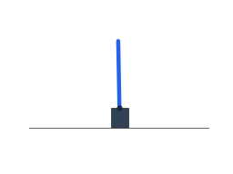
  
  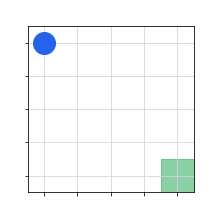
</p>

<p align="center"><em>PPO balances CartPole · SAC swings up Pendulum · Q-Learning navigates GridWorld — all rendered by <code>python examples/record_gifs.py</code>.</em></p>

---

## Applied solutions

The flagship of `decisionrl`: **seven environments that model real operational
decisions**, each shipped with the classic operations-research baseline so a
learned policy can be *proved* better (or honestly shown to match). Train them and
print the proof table with
[`python examples/applied_rl_demo.py`](examples/applied_rl_demo.py); the two figures
below come from [`python examples/applied_demo.py`](examples/applied_demo.py). New to
this? Start with the notebook: [**Applied RL in 15 minutes**](examples/applied_rl.ipynb)
[](https://colab.research.google.com/github/DenisDrobyshev/decisionrl/blob/main/examples/applied_rl.ipynb).
▶ **[Live browser demo](https://denisdrobyshev.github.io/decisionrl/demo/inventory.html)** — watch the learned policy beat the fixed base-stock on drifting demand, running entirely in your browser (no server).

| Applied task | What the agent decides | Baseline |
|---|---|---|
| 📈 Non-stationary inventory | how much to reorder as demand drifts | best fixed base-stock *(RL wins)* |
| 🚚 Supply chain (2-echelon) | orders across the chain | per-echelon base-stock *(RL wins)* |
| 🎛️ Queue admission control | admit or shed each job | admit-all *(RL wins)* |
| 🔋 Energy microgrid | charge/discharge a battery | no battery *(RL wins)* |
| 🌡️ Thermostat / HVAC | heating/cooling power | bang-bang *(RL wins)* |
| 📦 Inventory (stationary) | how much to reorder | base-stock *(RL matches the optimum)* |
| 🏷️ Dynamic pricing | what price to set | best fixed price *(RL matches the optimum)* |

### 📦 Inventory management (operations research)

An agent sets weekly re-order quantities under stochastic (Poisson) demand,
trading off holding cost, ordering cost and stockouts. **PPO recovers the optimal
base-stock policy from scratch** — it matches the analytic heuristic
(**≈ 195 vs 197** profit) and crushes a random policy (**≈ 160**), with zero
domain knowledge.

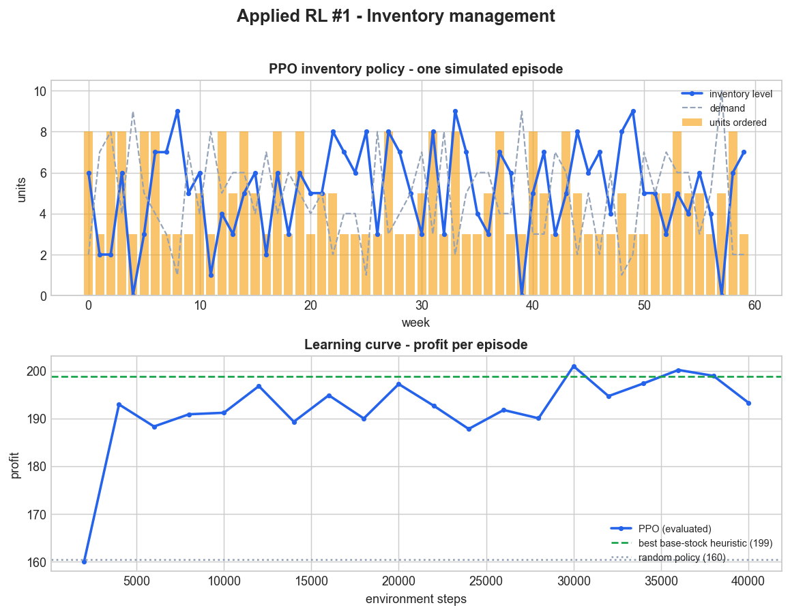

### 🌡️ Thermostat / HVAC control (energy)

An agent modulates a heating/cooling unit to hold a room at its setpoint while the
outdoor temperature swings on a daily cycle. **SAC tracks the setpoint smoothly
using about ⅓ of the energy of a bang-bang thermostat** (return **≈ −36 vs −304**;
energy **≈ 59 vs 200**).

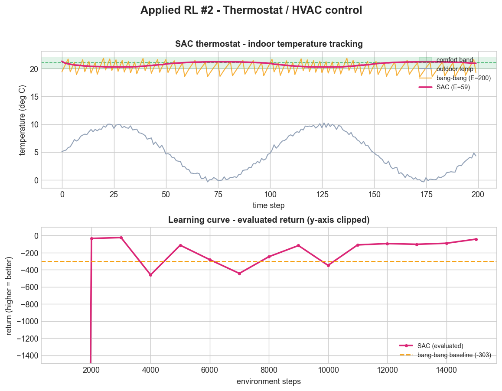

---

## Complex scenarios

Beyond the toy tasks, `decisionrl` ships four **harder, higher-dimensional
environments** from distinct domains — richer observations, non-linear dynamics
and real exploration / credit-assignment challenges. Train them all with
[`python examples/complex_scenarios.py`](examples/complex_scenarios.py) (uses the
GPU automatically). Measured results (random start → after training):

| Scenario | Domain | Obs · Action | Algorithm | Return: before → after |
|---|---|---|---|---|
| 🦾 **ReacherArm** | robotic manipulation | Box(10) · Box(2) | SAC | −8.1 → **−5.6** |
| 🧭 **Navigation2D** (lidar maze) | navigation / hard exploration | Box(14) · Box(2) | SAC | −9.5 → **+5.0** (reaches goal) |
| 🚀 **LunarLander** | rocket soft-landing | Box(8) · Discrete(4) | PPO | −435 → **+79** (lands) |
| 📈 **PortfolioAllocation** | finance / allocation | Box(4n) · Box(n) | SAC | beats equal-weight (**≈ +1.5 vs ≈ 0**, momentum market) |

Each is self-contained (NumPy only, Gymnasium API) — see the
[environments docs](docs/environments.md). `Navigation2D` pairs naturally with the
[curiosity bonuses](#curiosity--return-conditioned-control) for sparse-reward
exploration.

Trained agents in action (record with [`examples/record_scenario_gifs.py`](examples/record_scenario_gifs.py)):

<p align="center">
  
  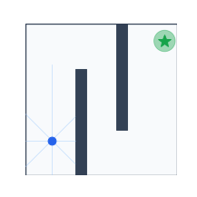
  
</p>

---

## Design principles

The applied focus sits on a deliberately engineered core: **every algorithm is
short and legible, but built from shared, swappable components** (buffers,
networks, policies, schedules, wrappers). Three principles guide it:

1. **Correctness-first.** The subtle things that quietly break RL agents are
   handled properly — most notably the Gymnasium `terminated` vs `truncated`
   distinction, which is bootstrapped correctly everywhere (time-limit
   truncation bootstraps from the final observation; true termination does not).
   It also ships GAE, target-policy smoothing, automatic entropy tuning,
   orthogonal init, advantage normalization and observation/reward normalization.
2. **Dependency-light & batteries-included.** The core needs only **NumPy + PyTorch**.
   Built-in environments (GridWorld, bandit, CartPole, Pendulum, PointMass) mean
   you can train an agent end-to-end with *zero* extra installs. Gymnasium is an
   optional extra, not a requirement.
3. **One API for everything.** Tabular or deep, discrete or continuous,
   on-policy or off-policy — every agent exposes the same four methods:
   `predict` · `learn` · `save` · `load`.

## Installation

```bash
# from PyPI — distributed as "decisionrl", imported as "decisionrl"
pip install decisionrl

# with Gymnasium environments
pip install "decisionrl[gym]"

# latest from source
pip install git+https://github.com/DenisDrobyshev/decisionrl.git

# local dev install
git clone https://github.com/DenisDrobyshev/decisionrl.git
cd decisionrl
pip install -e ".[dev]"
```

One name everywhere: the PyPI distribution, the import package and the repo are
all `decisionrl`.

## Quick start

**Applied RL** — learn an operational policy and beat the textbook heuristic:

```python
from decisionrl import make_env, make_agent
from decisionrl.training import evaluate_policy

# how much to reorder each week under stochastic demand
env = make_env("InventoryManagement")
agent = make_agent("ppo", env, seed=0).learn(40_000)
print(evaluate_policy(agent, make_env("InventoryManagement"), n_episodes=20))
# -> profit on par with the optimal base-stock policy, learned from scratch
```

The same four-method API (`predict` / `learn` / `save` / `load`) covers classic
control too:

```python
from decisionrl.algorithms import PPO
from decisionrl.envs import CartPole
from decisionrl.training import evaluate_policy
from decisionrl.utils import set_seed

set_seed(0)
agent = PPO(CartPole(), n_steps=1024, seed=0)
agent.learn(total_steps=50_000)

mean, std = evaluate_policy(agent, CartPole(), n_episodes=20)
print(f"return = {mean:.1f} +/- {std:.1f}")

agent.save("ppo_cartpole.pt")
agent = PPO.load("ppo_cartpole.pt", env=CartPole())
```

Tabular control is just as simple:

```python
from decisionrl.algorithms import QLearning
from decisionrl.envs import GridWorld

agent = QLearning(GridWorld(rows=5, cols=5), seed=0)
agent.learn(total_steps=20_000)
```

Continuous control with SAC:

```python
from decisionrl.algorithms import SAC
from decisionrl.envs import Pendulum

agent = SAC(Pendulum(), seed=0)
agent.learn(total_steps=20_000)
```

Use a Gymnasium environment (optional extra):

```python
from decisionrl.algorithms import PPO
from decisionrl.envs import make_gym

agent = PPO(make_gym("CartPole-v1"), seed=0)
agent.learn(total_steps=100_000)
```

Scale on-policy training with vectorized environments:

```python
from decisionrl.algorithms import PPO
from decisionrl.envs import CartPole
from decisionrl.wrappers import SyncVectorEnv

venv = SyncVectorEnv([lambda: CartPole() for _ in range(8)])
agent = PPO(venv, n_steps=256, seed=0)   # 8 x 256 = 2048 steps per update
agent.learn(total_steps=200_000)
```

## Command-line interface

Train and evaluate without writing a script — tuned default hyperparameters are
applied automatically per (algorithm, environment) and can be overridden:

```bash
decisionrl list                                          # show algorithms & envs
decisionrl train ppo CartPole --steps 50000 --save ppo.pt --progress
decisionrl train dqn CartPole --set learning_rate=5e-4 --set buffer_size=100000
decisionrl train ppo CartPole --n-envs 8 --async         # parallel data collection
decisionrl eval ppo --env CartPole --load ppo.pt --episodes 20
decisionrl play ppo --env CartPole --load ppo.pt        # watch the trained agent
decisionrl train ppo gym:LunarLander-v2 --steps 200000   # any Gymnasium env
decisionrl dashboard run.csv                             # live web dashboard (reward/loss)
```

`decisionrl dashboard <metrics.csv>` serves a lightweight live dashboard (Flask +
Plotly) that auto-refreshes one chart per metric as training writes the CSV.

Programmatic equivalents via the registry:

```python
from decisionrl import make_env, make_agent, make_vec_env
agent = make_agent("ppo", make_env("CartPole"), seed=0).learn(50_000)
venv = make_vec_env("CartPole", n_envs=8, asynchronous=True)   # one-line vectorization
```

## Training utilities & callbacks

```python
from decisionrl.algorithms import PPO
from decisionrl.envs import CartPole
from decisionrl.training import ProgressBarCallback, EvalCallback, CheckpointCallback, CallbackList

agent = PPO(CartPole(), anneal_lr=True, seed=0)      # linear LR decay (best practice)
agent.learn(100_000, callback=CallbackList([
    ProgressBarCallback(),                            # live tqdm bar (steps/s, ETA, return)
    EvalCallback(CartPole(), eval_freq=5000, best_model_save_path="best.pt"),
    CheckpointCallback(save_freq=20_000, save_dir="checkpoints"),
]))
```

## Beyond operations

Everything above is the operational core. But `decisionrl` is also a full,
correctness-first reinforcement-learning library — the same components implement the
broader RL curriculum. It's here for two reasons: occasionally an operational problem
needs one of these, and a working, tested implementation of each is evidence the
fundamentals are right. **If you only care about operations, you can stop here.**

<details>
<summary><b>What else is in the box</b> (31 algorithms + tooling)</summary>

## Algorithm zoo

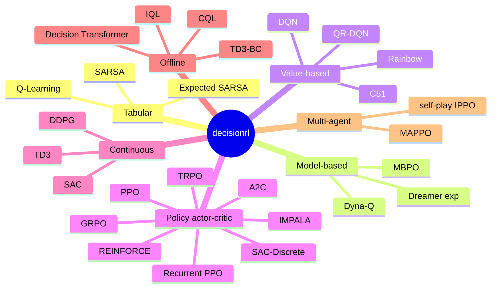

Value-based (DQN/C51/QR-DQN/Rainbow), policy-gradient & actor-critic (REINFORCE/A2C/PPO/TRPO/GRPO/IMPALA/Recurrent-PPO/SAC), continuous control (DDPG/TD3/SAC), offline RL (TD3+BC/IQL/CQL/Decision Transformer), model-based (Dyna-Q/MBPO/Dreamer), **RLHF & DPO**, char-GPT LLM alignment, imitation (BC/DAgger/GAIL), diffusion policies, curiosity (RND/ICM), **AlphaZero** (MCTS + self-play), meta-RL (RL²), 12 gradient-free optimizers, multi-agent (self-play/IPPO), distributed IMPALA actors, and ONNX/TorchScript serving.

</details>

## Algorithms

| Family | Algorithm | Class | Action space | Key features |
|---|---|---|---|---|
| Tabular | Q-Learning | `QLearning` | Discrete | off-policy TD |
| Tabular | SARSA | `SARSA` | Discrete | on-policy TD |
| Tabular | Expected SARSA | `ExpectedSARSA` | Discrete | lower-variance TD |
| Model-based | Dyna-Q | `DynaQ` | Discrete | learned model + planning (Sutton 1990) |
| Model-based | MBPO | `MBPO` | Continuous | ensemble dynamics + short rollouts + SAC |
| Model-based | Dreamer* | `Dreamer` | Continuous | latent world model + imagination (*experimental) |
| Model-based | DreamerRSSM* | `DreamerRSSM` | Continuous | **RSSM** world model (GRU + stochastic latent + KL) (*experimental) |
| Value-based | DQN | `DQN` | Discrete | Double · Dueling · PER · **n-step** · CNN |
| Value-based | C51 | `C51` | Discrete | distributional (categorical) DQN |
| Value-based | QR-DQN | `QRDQN` | Discrete | distributional (quantile regression) |
| Value-based | **Rainbow** | `Rainbow` | Discrete | Double+Dueling+PER+n-step+C51+NoisyNets |
| Goal-conditioned | **HER** + DQN | `HERDQN` | Discrete (goal env) | hindsight goal relabeling for sparse rewards |
| Policy gradient | REINFORCE | `REINFORCE` | Discrete + Continuous | learned baseline |
| Actor-critic | A2C | `A2C` | Discrete + Continuous | GAE, vectorized |
| Actor-critic | PPO | `PPO` | Discrete + Continuous | clipped objective, GAE, KL early-stop |
| Actor-critic | **TRPO** | `TRPO` | Discrete + Continuous | KL trust region, conjugate-gradient natural step, line search |
| Actor-critic | **GRPO** | `GRPO` | Discrete + Continuous | critic-free, group-relative advantage (LLM-RLHF) |
| Actor-critic | IMPALA | `IMPALA` | Discrete + Continuous | V-trace, parallel actors |
| Actor-critic | Recurrent PPO | `RecurrentPPO` | Discrete | LSTM policy for partial observability |
| Actor-critic | SAC (discrete) | `SACDiscrete` | Discrete | max-entropy, auto temperature |
| Continuous | DDPG | `DDPG` | Continuous | deterministic policy, noise · PER · n-step |
| Continuous | TD3 | `TD3` | Continuous | twin critics, delayed updates · PER · n-step |
| Continuous | SAC | `SAC` | Continuous | max-entropy, auto temperature · PER · n-step |
| Offline | TD3+BC | `TD3BC` | Continuous | learns from a fixed dataset (no env) |
| Offline | IQL | `IQL` | Continuous | expectile value + advantage-weighted policy |
| Offline | CQL | `CQL` | Continuous | conservative Q-learning (SAC backbone) |
| Offline | **Decision Transformer** | `DecisionTransformer` | Discrete + Continuous | return-conditioned sequence modeling (GPT) |
| Imitation | **Diffusion Policy** | `DiffusionPolicy` | Continuous | conditional denoising-diffusion policy (robotics) |

See [reproduced benchmark scores](docs/benchmarks.md) for all algorithms.

## RLHF & LLM-style alignment

The same recipe that aligns language models, on control tasks: learn a reward
from **preferences**, then optimize a policy against it with **GRPO** — the
critic-free method behind modern LLM RLHF.

```python
from decisionrl.envs import PointMass
from decisionrl.rlhf import collect_segments, synthetic_preferences, RewardModel, train_reward_model
from decisionrl.algorithms import SAC

env = PointMass()
segments = collect_segments(env, lambda o: env.action_space.sample(), n_segments=120, seg_len=25, seed=0)
prefs = synthetic_preferences(segments, n_pairs=800, seed=1)          # a preference teacher

reward_model = RewardModel(obs_dim=2, action_space=env.action_space, use_action=False)
train_reward_model(reward_model, prefs, n_iters=500)                  # Bradley-Terry likelihood
# -> learned reward correlates ≈0.98 with the true reward; optimize any agent on it:
from decisionrl.rlhf import RewardModelWrapper
agent = SAC(RewardModelWrapper(env, reward_model), seed=0).learn(20_000)
```

Or skip the reward model entirely with **DPO** (Direct Preference Optimization —
the method behind modern LLM alignment), which optimizes the policy *directly*
from preference pairs against a frozen reference:

```python
from decisionrl.rlhf import DPO
dpo = DPO(PointMass(), beta=0.5, seed=0)
dpo.train(prefs, n_iters=600)     # no reward model, no RL loop
# learns the implicit reward directly — ≈0.9 held-out preference accuracy
```

`decisionrl.rlhf` provides `RewardModel`, `PreferenceDataset`, `collect_segments`,
`synthetic_preferences`, `train_reward_model`, `RewardModelWrapper` and `DPO`.

## Imitation learning

Learn from demonstrations instead of rewards — **BC** (behavioral cloning),
**DAgger** (dataset aggregation, fixes BC's compounding error) and **GAIL**
(adversarial imitation: a discriminator the policy learns to fool). BC and DAgger
clone a CartPole expert to a perfect return of 500; GAIL matches it using only
demonstrations and **no environment reward**.

```python
from decisionrl.imitation import BC, GAIL, collect_expert_dataset
from decisionrl.envs import CartPole

demos = collect_expert_dataset(CartPole(), expert_policy, n_transitions=4000, seed=0)
bc = BC(CartPole(), seed=0); bc.train(demos, n_iters=1500)          # supervised cloning
gail = GAIL(CartPole(), demos, seed=0).learn(iterations=10)          # adversarial, reward-free
```

Or model the policy as a **conditional denoising diffusion** over actions
(`DiffusionPolicy`, as in robotics) — it clones a PointMass expert to within noise
of optimal and can represent multimodal action distributions a Gaussian cannot.

## LLM alignment (RLHF on a language model)

The full RLHF loop industry uses to align LLMs, on a tiny char-level GPT:
pre-train (SFT), then fine-tune it toward a reward while a **KL penalty keeps the
policy close to the reference model** (GRPO-style group-normalized advantages, no
value network). Steering a model toward more `"o"` lifts its frequency from
**≈0.09 to ≈0.47** while staying readable.

```python
from decisionrl.text import CharTokenizer, CharGPT, sft_train, rlhf_finetune, char_frequency_reward

tok = CharTokenizer(corpus)
lm = CharGPT(tok.vocab_size, block_size=64)
sft_train(lm, tok, corpus, n_iters=2000)                       # supervised pre-training
rlhf_finetune(lm, tok, char_frequency_reward("o"), kl_coef=0.05)  # align to a reward + KL
```

## Curiosity & return-conditioned control

```python
# Intrinsic motivation: any agent gets exploration on sparse-reward tasks for free.
from decisionrl.exploration import RND, CuriosityWrapper
from decisionrl.algorithms import DQN
env = CuriosityWrapper(CartPole(), RND(obs_dim=4))      # or ICM(...)
DQN(env, seed=0).learn(50_000)

# Decision Transformer: offline RL as return-conditioned sequence modeling.
from decisionrl import collect_trajectories
from decisionrl.algorithms import DecisionTransformer
data = collect_trajectories(CartPole(), policy, n_trajectories=150, seed=0)
dt = DecisionTransformer(CartPole(), seed=0).learn_offline(data, n_iters=2500)
dt.evaluate(CartPole(), target_return=500)             # condition on the return you want
```

## Evolutionary & swarm optimization

A full family of **gradient-free** optimizers under one ask/tell interface —
evolution strategies **CEM · CMA-ES · Differential Evolution · Genetic Algorithm ·
OpenAI-ES · ARS · Simulated Annealing** and swarm intelligence **PSO · Firefly ·
Artificial Bee Colony · Grey Wolf · Bat · Ant Colony (TSP)** — plus a
`NeuroevolutionAgent` that trains RL policies with any of them (no gradients).

```python
from decisionrl.evolution import CEM, minimize
from decisionrl.evolution.functions import rastrigin
x, f, history = minimize(rastrigin, CEM(dim=10, bounds=(-5.12, 5.12), seed=0), iters=200)

# Neuroevolution: solve CartPole with a gradient-free optimizer
from decisionrl.evolution import NeuroevolutionAgent
from decisionrl.envs import CartPole
agent = NeuroevolutionAgent(CartPole(), optimizer="cmaes", seed=0).learn(60_000)
```

All twelve optimizers converge on the multimodal Rastrigin function (Grey Wolf
reaches ~1e-9); every neuroevolution optimizer **solves CartPole (return 500) with
no gradients**; and Ant Colony Optimization finds short TSP tours. Reproduce with
[`python examples/evolution_demo.py`](examples/evolution_demo.py).

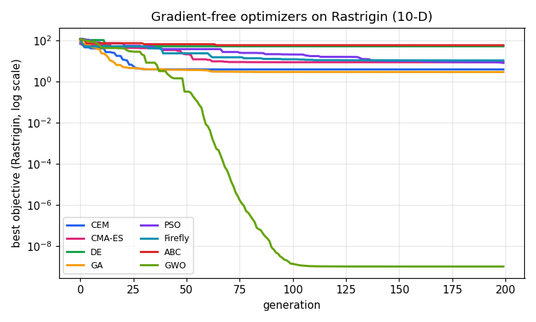

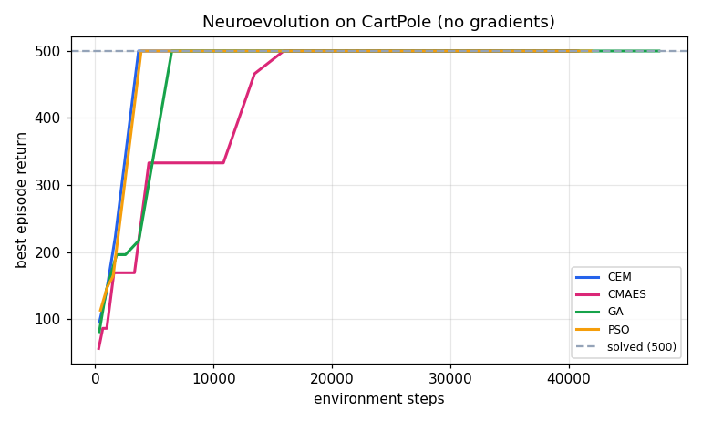

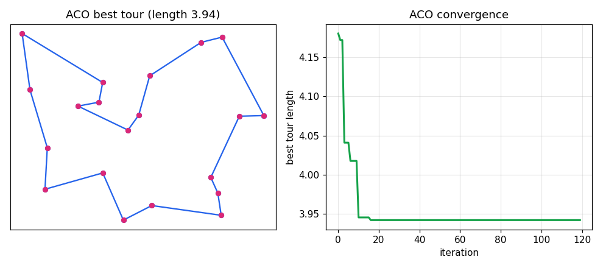

## AlphaZero (MCTS + self-play)

`decisionrl.alphazero` implements AlphaZero for two-player perfect-information
games — Monte-Carlo Tree Search guided by a policy+value network, trained purely
by **self-play** (no human games, no reward shaping). Ships `TicTacToe` and
`Connect4`; add a game by implementing the `Game` interface.

```python
from decisionrl.alphazero import AlphaZero, TicTacToe
agent = AlphaZero(TicTacToe(), n_simulations=60, seed=0)
agent.learn(iterations=12, games_per_iter=30)     # self-play + training
action = agent.predict(state, player=1)            # MCTS-backed move
```

Trained by self-play alone, it learns Tic-Tac-Toe to near-perfect play (stops
losing to a random opponent). Reproduce with
[`python examples/alphazero_demo.py`](examples/alphazero_demo.py).


## Meta-RL (RL²)

`decisionrl.meta` implements **RL²** — meta-learning by training a *recurrent*
policy across a distribution of tasks so its hidden state adapts online, with **no
gradient steps at test time**. The mechanism is all in the environment: `RL2Env`
feeds the previous action/reward/done alongside each observation and keeps one task
alive for a whole "trial".

```python
from decisionrl.algorithms import RecurrentPPO
from decisionrl.meta import make_meta_bandit
from decisionrl.wrappers import SyncVectorEnv

# a distribution of 5-armed Bernoulli bandits (arm odds resampled each trial)
venv = SyncVectorEnv([lambda i=i: make_meta_bandit(n_arms=5, horizon=30, seed=i)
                      for i in range(32)])
agent = RecurrentPPO(venv, n_steps=30, gae_lambda=0.3, seed=0).learn(500_000)
```

On held-out bandits the meta-trained policy explores then locks onto the best arm —
pulling it far more often than chance — a bandit algorithm discovered by gradient
descent. See [docs](docs/meta.md).

## Serving trained policies

Export any trained agent to **ONNX** (or TorchScript) and serve it over HTTP —
the serving image needs only `onnxruntime` + FastAPI, no PyTorch.

```python
from decisionrl.algorithms import PPO
from decisionrl.envs import CartPole
from decisionrl.serving import export_onnx, OnnxPolicy

agent = PPO(CartPole(), seed=0).learn(50_000)
export_onnx(agent, "policy.onnx")            # + policy.onnx.json metadata
action = OnnxPolicy("policy.onnx").predict(obs)   # inference without torch
```

```bash
# FastAPI service (POST /predict, GET /health, GET /info) — see deploy/Dockerfile
DECISIONRL_MODEL=policy.onnx uvicorn decisionrl.serving.server:app
```

Store and reload pretrained policies with the **model zoo**, and run a policy
**entirely in the browser** — `examples/make_browser_demo.py` writes a
self-contained [`docs/demo/cartpole.html`](docs/demo/cartpole.html) that plays
CartPole with the trained network in pure JavaScript (no server, no CDN):

```python
from decisionrl.zoo import save_to_zoo, load_pretrained, list_pretrained
save_to_zoo(agent, "cartpole-ppo")            # export to the zoo (ONNX)
policy = load_pretrained("cartpole-ppo")       # torch-free inference later
```

## Multi-agent

```python
from decisionrl.multiagent import MultiAgentPPO, RockPaperScissors, CoordinationGame

# self-play (one shared policy controls every agent)
selfplay = MultiAgentPPO(RockPaperScissors(), shared_policy=True, seed=0).learn(40_000)

# independent PPO (a separate policy per agent) on a cooperative game
ippo = MultiAgentPPO(CoordinationGame(), shared_policy=False, seed=0).learn(20_000)
```

`decisionrl.multiagent` adds a `MultiAgentEnv` interface, example games, and
`MultiAgentPPO` (self-play or IPPO). See the [multi-agent docs](docs/multiagent.md).

## Distributed training

```python
from decisionrl import DistributedActorLearner
from decisionrl.envs import CartPole

# real actor processes stream trajectories to a central V-trace learner
learner = DistributedActorLearner(CartPole, num_actors=8, seed=0).learn(200_000)
```

`DistributedActorLearner` is a true multi-process, IMPALA-style architecture: each
actor runs its own environment and local policy inference in a separate process,
and the learner performs V-trace updates and broadcasts fresh weights every
iteration.

## Components you can reuse

```
decisionrl
├── core         # Env, Wrapper, Space (Box/Discrete), BaseAgent, Transition
├── envs         # applied: Inventory, DynamicPricing, QueueAdmissionControl,
│                 #   EnergyMicrogrid, SupplyChain, Thermostat;
│                 #   control: GridWorld, CartPole, Pendulum, PointMass; make_gym
├── buffers      # ReplayBuffer, PrioritizedReplayBuffer (sum-tree), RolloutBuffer (GAE)
├── networks     # build_mlp, QNetwork, Dueling/CategoricalQNetwork (C51),
│                 #   CNNFeatureExtractor + ImageQNetwork (pixels),
│                 #   Categorical/Gaussian/Squashed policies
├── exploration  # Linear/Exponential schedules, Gaussian & Ornstein-Uhlenbeck noise
├── wrappers     # TimeLimit, NormalizeObservation, NormalizeReward,
│                 #   SyncVectorEnv, AsyncVectorEnv (multiprocessing),
│                 #   FrameStack, FlattenObservation, OneHotObservation
├── utils        # set_seed, Logger (stdout/CSV/TensorBoard), RunningMeanStd, torch helpers
├── training     # evaluate_policy, Callback, EvalCallback, StopOnRewardThreshold
└── algorithms   # all 31 agents above
```

Everything is duck-typed against the Gymnasium API, so `decisionrl` components and
Gymnasium environments interoperate freely in either direction.

## Reproducibility

```python
from decisionrl.utils import set_seed
set_seed(42, deterministic=True)   # seeds Python, NumPy, PyTorch (+ deterministic kernels)
```

Every agent accepts a `seed=` argument, every environment accepts `reset(seed=...)`,
and every buffer/space has its own seedable RNG.

## Development & testing

```bash
pip install -e ".[dev]"
pytest              # full suite (unit + integration "does it actually learn?" tests)
ruff check .        # lint
```

The test suite covers component correctness (spaces, buffers, sum-tree,
schedules, GAE, normalization, save/load round-trips) **and** learning behaviour:
tabular methods reach the optimal policy on GridWorld, DQN/PPO learn CartPole,
and SAC/TD3/DDPG solve the PointMass reaching task.

## Design notes

- **terminated vs truncated.** Off-policy buffers store the `terminated` flag
  only, so bootstrapping targets are correct on time-limit truncation. On-policy
  rollouts augment the reward with `gamma * V(final_obs)` at truncated steps and
  mark the episode boundary — the Stable-Baselines3 approach.
- **No hidden global state.** No registries, no config magic; you construct
  objects and call methods.
- **Small surface, deep correctness.** The goal is a foundation you can read in
  an afternoon and trust in a paper.

## License

[MIT](LICENSE) © 2026 Denis Drobyshev

## Acknowledgements

Inspired by the clarity of CleanRL, the API design of Stable-Baselines3, the
modularity of Tianshou, and the Farama Foundation's Gymnasium standard.
