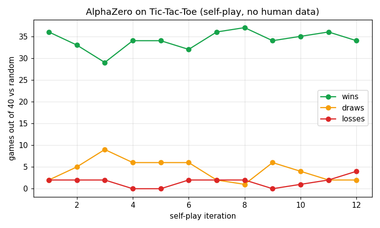

# AlphaZero (MCTS + self-play)

`reinforce.alphazero` implements AlphaZero (Silver et al., 2017) for two-player,
perfect-information games. It learns **purely from self-play**: Monte-Carlo Tree
Search guided by a policy+value network acts as a policy-improvement operator, and
the network is trained to imitate the improved (visit-count) policy and predict
the game outcome. No human games, no reward shaping.

```python
from reinforce.alphazero import AlphaZero, TicTacToe, pit, random_player
import numpy as np

game = TicTacToe()
agent = AlphaZero(game, n_simulations=60, seed=0)
agent.learn(iterations=12, games_per_iter=30)      # self-play + training

# play a move from any position (MCTS-backed)
state = game.get_initial_state()
action = agent.predict(state, player=1)

# evaluate vs a random opponent
rng = np.random.default_rng(0)
print(pit(game, lambda s, p: agent.predict(s, p),
          lambda s, p: random_player(game, s, p, rng), n_games=40))
```



## Components

| Piece | Class | Role |
|---|---|---|
| Games | `TicTacToe`, `Connect4` | canonical-form 2-player games (`Game` interface) |
| Network | `AlphaZeroNet` | residual conv net with policy + value heads |
| Search | `MCTS` | PUCT tree search with the network prior + Dirichlet root noise |
| Agent | `AlphaZero` | self-play data generation, training, and MCTS-backed `predict` |

Add a new game by implementing the `Game` interface (`get_next_state`,
`get_valid_moves`, `check_win`, ...) — the network, search and training loop are
game-agnostic.
