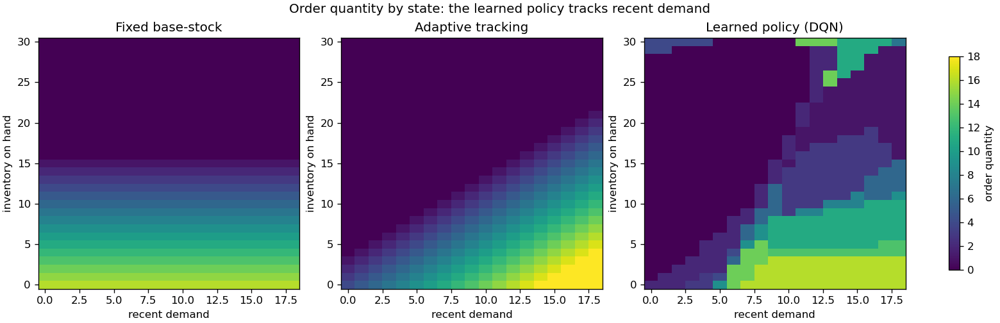

# Interpreting a learned policy

A learned policy is often treated as a black box, but for the applied environments its
decision rule lives in a small, interpretable state space, so it can be drawn. This makes
it possible to check *what* the agent learned, not just that its return went up.

The figure below trains a DQN on
[`NonstationaryInventory`](https://github.com/DenisDrobyshev/decisionrl/blob/main/src/decisionrl/envs/nonstationary_inventory.py)
and plots the order quantity it chooses at every state (inventory on hand against recent
demand), next to the two classical rules on the same grid. Reproduce it with:

```bash
python examples/policy_heatmap.py
```



Reading the three panels:

- **Fixed base-stock.** The order depends only on inventory (horizontal bands) and
  ignores recent demand. This is the rule's defining limitation: one order-up-to level
  for every demand era.
- **Adaptive tracking.** The order rises with recent demand and falls with inventory, a
  clean diagonal structure. This is the rule that encodes the right domain knowledge.
- **Learned policy.** The DQN was given only the reward signal, yet its map resembles the
  adaptive rule far more than the fixed one: it too raises the order when recent demand is
  high. That is the mechanism behind its edge over the fixed base-stock, made visible.

The point is not that the learned policy is perfect (its map is noisier, and a hand-coded
adaptive rule does better still, as the [case study](case-study.md) shows). It is that the
policy is inspectable: you can see the structure it discovered and judge whether it is
sensible before trusting it.
